# Exam #1: "Last Race"
## Student: s123456 LASTNAME FIRSTNAME 

## React Client Application Routes

- Route `/`: Home page. Displays game instructions. Unauthenticated users can only see this page.
- Route `/login`: Login page. Contains the form to authenticate the user.
- Route `/play`: The main Game Manager. It acts as a state machine managing four child phases: `Setup` (shows network map), `Planning` (90s timer, route building), `Execution` (animated step-by-step event log), and `Result` (win/loss summary).
- Route `/rankings`: Leaderboard page. Displays a table of all registered users and their highest scores.
- Route `/history`: User history page. Displays all past games played by the currently logged-in user.

## API Server

- POST `/api/sessions`
  - Request body: `{ "username": "blossom", "password": "password" }`
  - Response body: `{ "id": 1, "username": "blossom" }` (If successful)
- GET `/api/sessions/current`
  - Request parameters: None (uses Session Cookie)
  - Response body: `{ "id": 1, "username": "blossom" }` or `{ "isAuthenticated": false }`
- DELETE `/api/sessions/current`
  - Request parameters: None
  - Response body: `{}`
- GET `/api/network`
  - Request parameters: None
  - Response body: `{ "stations": [...], "segments": [...] }` (Contains all stations and valid connecting segments).
  - Example: {"stations": [
        {
            "id": 1,
            "name": "Centrale"
        }, ...
      ],
       "segments": [
        {
            "stationA_id": 1,
            "stationA_name": "Centrale",
            "stationB_id": 2,
            "stationB_name": "Porta Velaria",
            "line_name": "Red Line",
            "line_color": "red"
        }, ...
       ]

  }
- GET `/api/rankings`
  - Request parameters: None
  - Response body: `[{ "username": "blossom", "best_score": 22 }, ...]`
- GET `/api/games/history`
  - Request parameters: None
  - Response body: `[{ "id": 1, "score": 15, "timestamp": "..." }, ...]`
- POST `/api/games/init`
  - Request parameters: None
  - Response body: `{ "startStation": {...}, "destStation": {...} }`. (Also securely saves the active game in `req.session`).
  - Example: {
    "startStation": {
        "id": 3,
        "name": "Crocevia del Falco"
    },
    "destStation": {
        "id": 10,
        "name": "Stazione Nord"
    }
}
- POST `/api/games/submit`
  - Request body: `{ "route": [{ "stationA_id": 1, "stationB_id": 2, ... }, ...] }`
  - Response body: `{ "success": true, "finalScore": 21, "log": [...] }` (Or `success: false` if the route is invalid).
  - Example: {
    "success": false,
    "message": "Your route was incomplete, disconnected, or used invalid tracks. You got lost in the underground!",
    "finalScore": 0,
    "log": []
}

## Database Tables

- Table `users` - contains `id`, `username`, `password` (hashed), and `salt`.
- Table `lines` - contains `id`, `name`, `color`.
- Table `stations` - contains `id`, `name`.
- Table `line_stations` - contains `line_id`, `station_id`, `stop_number`. Resolves the network geometry dynamically.
- Table `events` - contains `id`, `description`, `effect`.
- Table `games` - contains `id`, `user_id`, `score`, `timestamp`.

## Main React Components

- `GameManager` (in `GameManager.jsx`): Manages the state machine (`setup`, `planning`, `execution`, `result`) and handles the API calls for initializing and submitting the game.
- `SetupPhase` (in `GamePhases.jsx`): Displays the network map and game rules, allowing the user to start the game.
- `PlanningPhase` (in `PlanningPhase.jsx`): Implements the 90-second countdown timer, manages the selected vs available segments pools, and handles the logic for flipping segments directionally. This is where the actual game logic happens for the user side.
- `ExecutionPhase` (in `GamePhases.jsx`): Progressively renders the server's event log array using `setTimeout` to create a step-by-step animation of the journey.
- `ResultPhase` (in `GamePhases.jsx`): Displays the final score and result of the game, with options to play again or return to the home page.
- `NetworkMap` (in `NetworkMap.jsx`): Dynamically renders an SVG planar graph of the underground network using pre-calculated coordinates to prevent line-crossing, applying CSS drop-shadows and pastel colors.
- `Header` (in `Header.jsx`): Displays the navigation bar, including links to the home page, rankings, and user authentication options.
- `Auth` (in `Auth.jsx`): Contains the `LoginForm`, `LoginButton`, and `LogoutButton` components for handling user authentication via context.
- `HomeLayout` (in `StaticLayouts.jsx`): Provides reusable layouts for static pages such as the home page, rankings, and history.
- `RankingsLayout` (in `StaticLayouts.jsx`): Displays the leaderboard with the highest scores of all registered users.
- `HistoryLayout` (in `StaticLayouts.jsx`): Displays the history of all past games played by the currently logged-in user.

## Screenshots
- **Non-user Home Page**: Displays the landing page for unauthenticated users.
  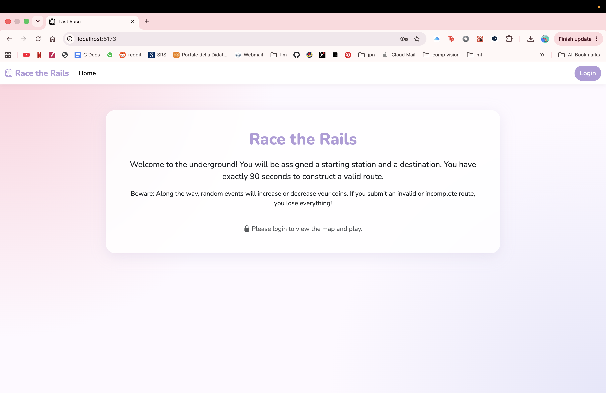

- **Login Page**: Allows users to authenticate with their credentials.
  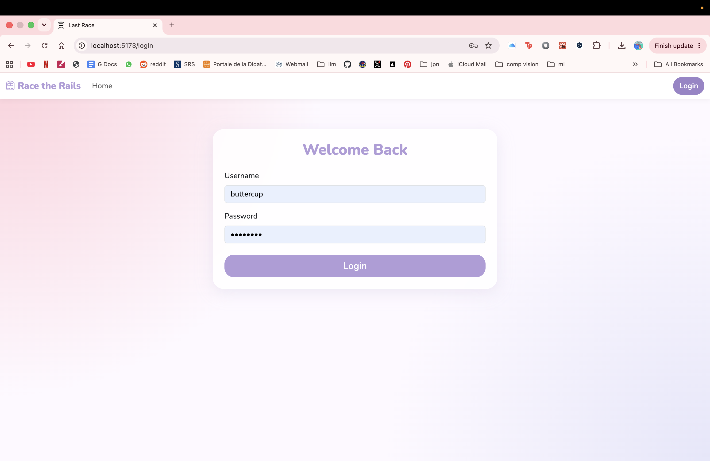

- **Login Home Page**: Displays the home page for logged-in users.
  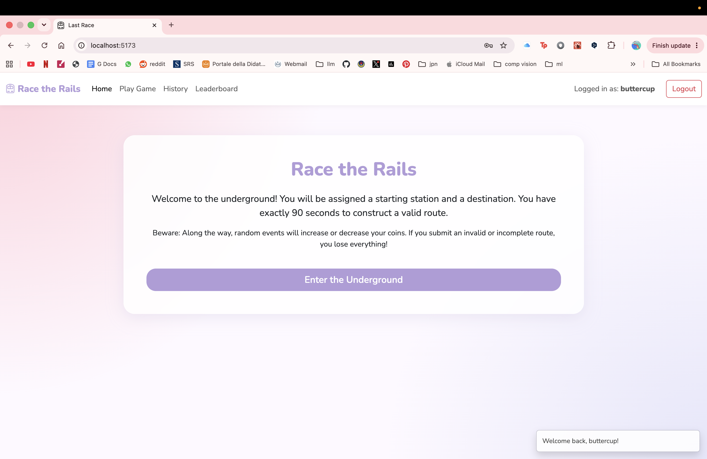

### Game Phases
- **Setup Phase**: Displays the network map and game rules.
  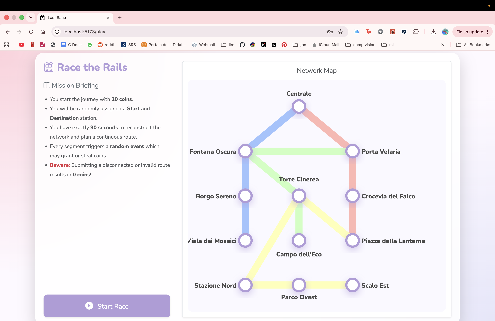

- **Planning Phase (Step 1)**: Allows the user to start building a route.
  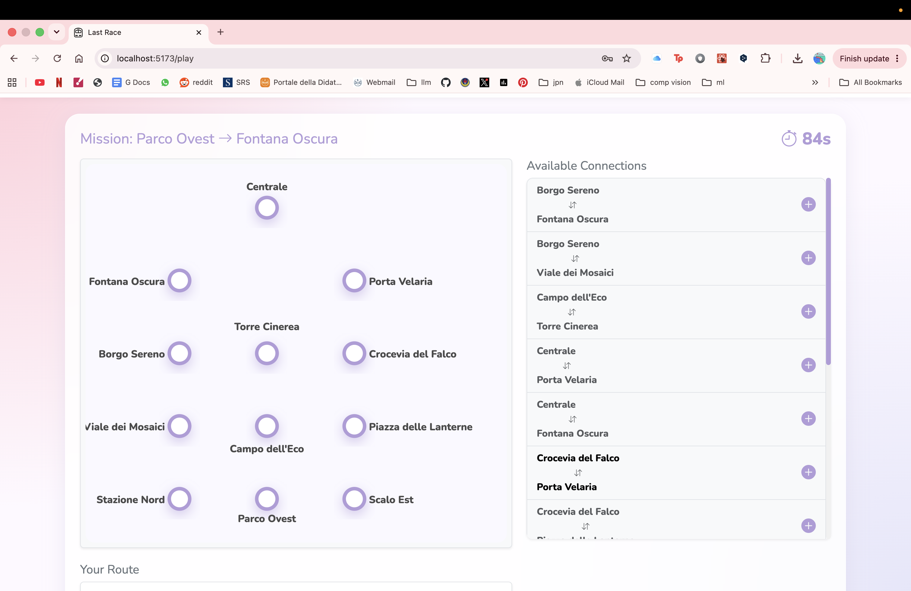

- **Planning Phase (Step 2)**: Shows the progress of route building.
  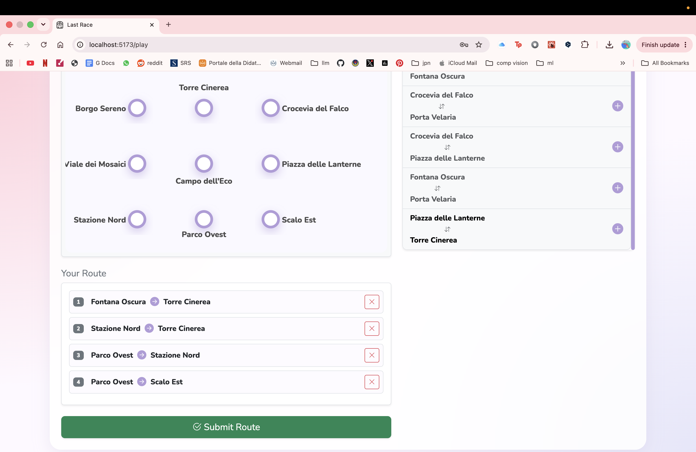

- **Execution Phase**: Animates the journey step-by-step with event logs.
  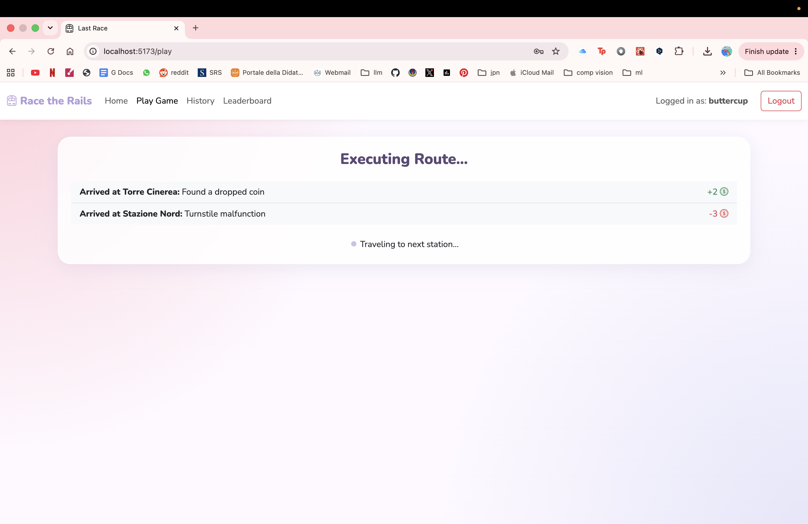

- **Game Over (Failure)**: Displays the result when the route is invalid or incomplete.
  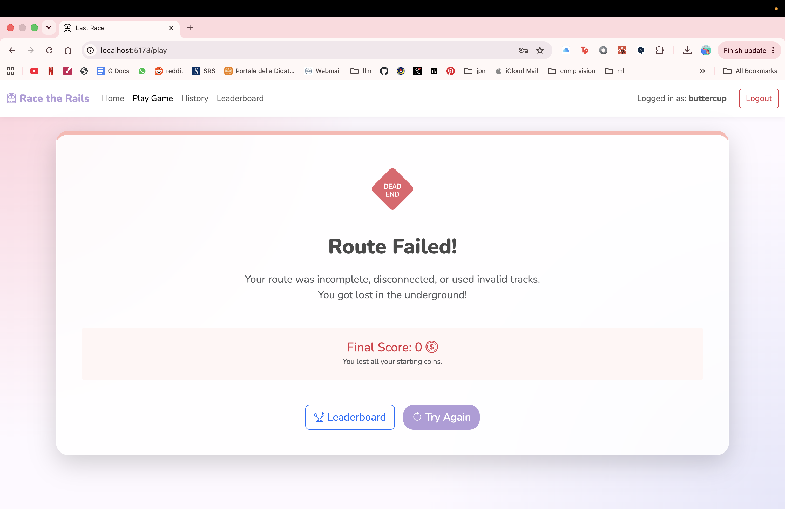

- **Game Over (Success)**: Displays the result when the route is valid and completed successfully.
  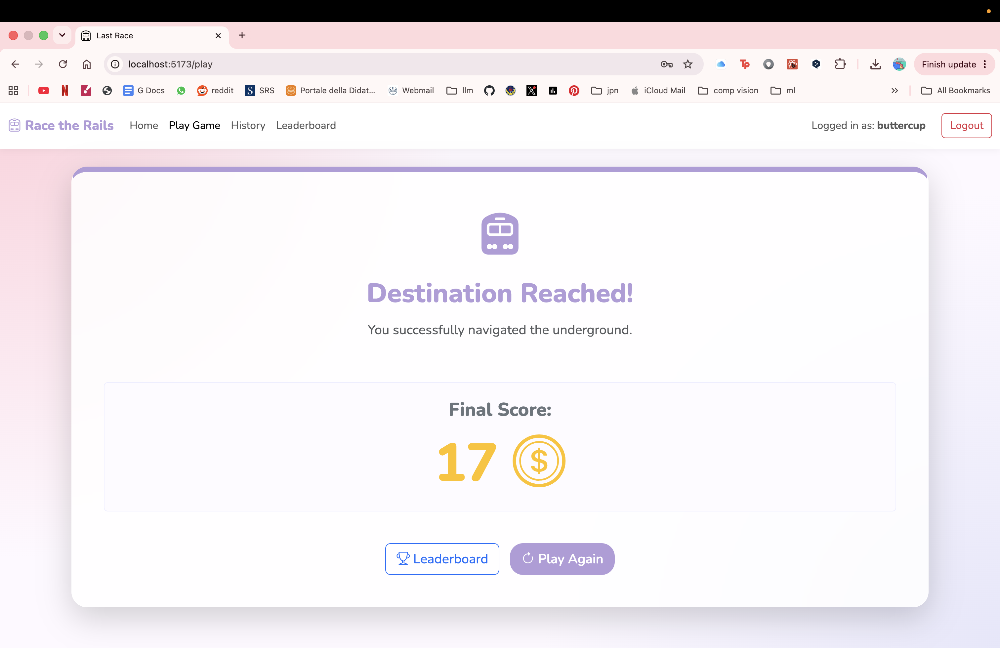

### Rankings and History
- **Rankings Page**: Displays the leaderboard with the highest scores of all users.
  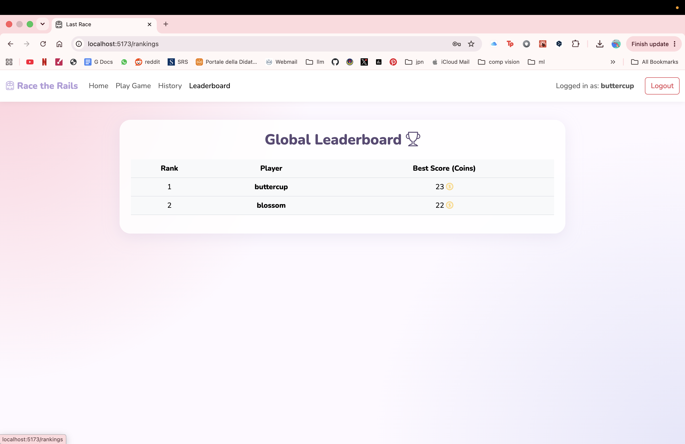

- **History Page**: Shows the history of past games played by the logged-in user.
  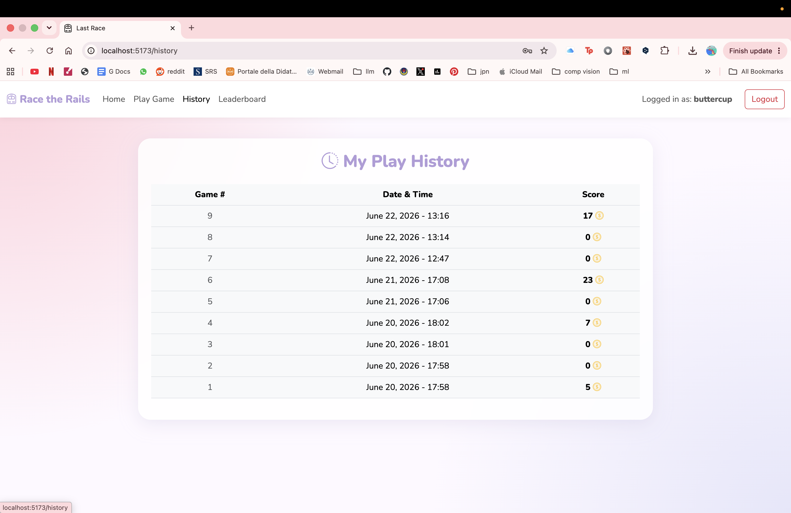

## Users Credentials

- `blossom`, `password`
- `bubbles`, `password`
- `buttercup`, `password`

## Use of AI Tools
I utilized AI tools (Gemini) during the development of this project primarily as a helper for architectural design and debugging. 
Specifically, I used AI to:
1. Frontend: Create custom css and generate the geometric mathematical coordinates (`layout`) for the SVG `NetworkMap` component to ensure lines did not overlap in the UI. Clarify debugging concepts regarding React Strict Mode behaviors and `useEffect` timer cleanups.
2. Database: Refine the SQLite DB initialization script to ensure the required constraints were met. The example stations in the requirements are used and the rest are created by AI to be similar.
3. Backend: Ensure the architecture complied with the requirements and for bug fixes. 

All AI-generated logic was thoroughly reviewed, adapted, and manually verified by myself to ensure it adhered strictly to the course's requirements and best practices.
